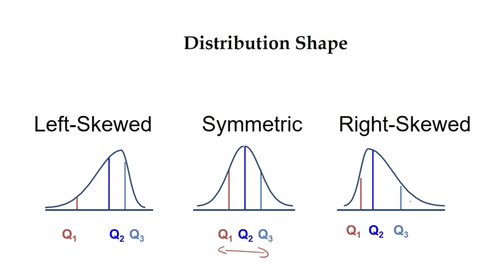

<p align="left">
  <a href="./data.md"><b>← Previous</b></a>
  <span style="float:right">
    <a href="./visualization.md"><b>Next →</b></a>
  </span>
</p>

---

# Descriptive statistics

Descriptive statistics are used to summarize and describe the main features of a dataset. They provide a way to understand the distribution, central tendency, and variability of the data. Common descriptive statistics include:
- **Mean**: The average value of a dataset.
- **Median**: The middle value when the data is sorted.
- **Mode**: The most frequently occurring value in the dataset.
- **Standard Deviation**: A measure of the amount of variation or dispersion in a dataset.
- **Variance**: The average of the squared differences from the mean.


## Types of descriptive statistics

```
Descriptive Statistics
├── Measures of Central Tendency
│   ├── Mean / Average
│   ├── Median
│   └── Mode
│
├── Measures of Variability / Spread
│   ├── Range
│   ├── Quantiles (Quartiles & Percentiles)
│   ├── Interquartile Range (IQR)
│   ├── Variance
│   └── Standard Deviation
│
├── Relative Measures
│   └── Coefficient of Variation (CV)
│
├── Distribution Rules
│   ├── Empirical Rule (68-95-99.7)
│   └── Chebyshev's Theorem
│
└── Measures of Relationship
    └── Correlation
```

### 1. Measures of central tendency
These statistics describe the **center** of a dataset — a single value that attempts to represent the "typical" value.

   1. **Mean/Avg** - the sum of all values divided by the number of values.
   2. **Median** - the middle value from the list, when the data is sorted in ascending or descending order. It is less affected by outliers than the mean, making it a better measure of central tendency for skewed distributions.
   3. **Mode** - the value that appears most frequently in a dataset. A dataset can have one mode (unimodal), more than one mode (multimodal), or no mode at all if all values are unique.

### 2. Measures of variability/spread
These statistics describe the **spread or dispersion** of a dataset — how far apart the values are from each other and from the center.

   1. **Range** - the difference between the maximum and minimum values in a dataset.
   2. **Quantiles** - values that divide a dataset into equal parts. Common quantiles include quartiles (divide data into four parts) and percentiles (divide data into 100 parts).
   3. **Interquartile Range (IQR)** - the difference between the third quartile (Q3) and the first quartile (Q1). It measures the spread of the middle 50% of the data and is less affected by outliers than the range.
   4. **Variance** - the average of the squared differences from the mean. It provides a measure of how much the values in a dataset vary from the mean.
   5. **Standard Deviation** - the square root of the variance. It is expressed in the same units as the original data and provides a measure of the average distance of each data point from the mean.

### 3. Relative measures
These statistics express variability **relative to the mean**, making it possible to compare spread across datasets with different units or scales.

   1. **Coefficient of Variation (CV)** - the ratio of the standard deviation to the mean, expressed as a percentage. It allows comparison of variability between datasets with different units or magnitudes.

### 4. Distribution rules
These rules describe **how data is distributed** around the mean, giving specific guarantees about what proportion of data falls within a certain number of standard deviations.

   1. **Empirical Rule (68-95-99.7)** - applies only to normal (bell-shaped) distributions. States that approximately 68%, 95%, and 99.7% of data falls within 1, 2, and 3 standard deviations of the mean, respectively.
   2. **Chebyshev's Theorem** - applies to **any** distribution (regardless of shape). Guarantees that at least $1 - \frac{1}{k^2}$ of data falls within $k$ standard deviations of the mean, for any $k > 1$.

### 5. Measures of relationship
These statistics describe the **direction and strength** of the relationship between two variables.

   1. **Correlation** - a standardized measure of the linear relationship between two variables, ranging from $-1$ (perfect negative) to $+1$ (perfect positive), with $0$ indicating no linear relationship.



Key terms related to descriptive statistics include:

- *Bell curve/normal distribution/gaussian distribution*: a symmetric, bell-shaped distribution that is characterized by its mean and standard deviation. It is often used to model real-world phenomena, such as heights, weights, and test scores.
- *Tail*: the part of a distribution that extends beyond the central part. It can be used to describe the shape of a distribution, such as whether it is skewed or symmetric.
- *Asymptodes*: line that never touches x-axis unless or untill it reaches infinity.
- *5 member summary*: a set of five values that summarize a dataset: minimum, first quartile (Q1), median (Q2), third quartile (Q3), and maximum. It provides a quick overview of the distribution and spread of the data.
- *Box plot & wisher plot* : offers a graphical representation of the 5 member summary

---

## Variance vs Coefficient of Variation

 **Variance** measures the average squared deviation from the mean — it tells you how spread out the data is, but in **squared units** (e.g., cm²), making it hard to interpret directly or compare across datasets with different scales.

**Coefficient of Variation (CV)** divides the standard deviation by the mean and expresses it as a **percentage** — it's _unitless_, so you can compare variability across completely different datasets.

| Aspect                | Variance ($\sigma^2$ / $s^2$)         | Coefficient of Variation ($CV$)            |
| :-------------------- | :------------------------------------ | :----------------------------------------- |
| **What it measures**  | Absolute spread around the mean       | Relative spread as a % of the mean         |
| **Units**             | Squared units (e.g., cm², $²)         | Unitless (percentage)                      |
| **Formula**           | $\frac{\sum(x_i - \bar{x})^2}{n}$     | $\frac{\sigma}{\mu} \times 100\%$          |
| **Use case**          | How spread out one dataset is         | Comparing spread across different datasets |
| **Example**           | Heights variance = 25 cm²             | Heights CV = 2.9%, Weights CV = 14%        |
| **Depends on scale?** | Yes — larger values → larger variance | No — normalized by the mean                |

**Key insight:** Two datasets can have the **same variance** but very different CVs — and vice versa.

> Example: Dataset A (mean = 1000, SD = 10) and Dataset B (mean = 10, SD = 10) have the **same** SD/variance, but CV_A = 1% vs CV_B = 100%. Dataset B is far more relatively variable.

In short: variance tells you "how much spread" in absolute terms; CV tells you "how much spread _relative to the size of the values_."

---

## Measures of Central Tendency

### 1. Mean (Average)

The mean is the sum of all values divided by the total number of values.

```
  Values:   3    7    5    9    6
            │    │    │    │    │
            └──┬─┴──┬─┴──┬─┘
               ▼    ▼    ▼
          Sum = 3 + 7 + 5 + 9 + 6 = 30
          n   = 5
               ┌─────────┐
          x̄  = │ 30 / 5  │ = 6
               └─────────┘
```

#### Real-World Use Cases
- **Finance**: Calculating the average monthly revenue of a business to assess overall performance.
- **Education**: Computing the average test score of a class to evaluate teaching effectiveness.
- **Healthcare**: Finding the average blood pressure of patients in a clinical trial to determine treatment outcomes.
- **Limitation**: Sensitive to outliers — e.g., a CEO's salary of \$10M in a company where most employees earn \$50K will drastically inflate the mean salary.

#### Steps
1. List all the values in the dataset.
2. Add all the values together to get the sum.
3. Count the total number of values ($n$).
4. Divide the sum by $n$.

#### Formula

$$
\bar{x} = \frac{\sum_{i=1}^{n} x_i}{n} = \frac{x_1 + x_2 + \cdots + x_n}{n}
$$

Where:
|      Symbol      | Pronunciation                  | Meaning                                                      |
| :--------------: | :----------------------------- | :----------------------------------------------------------- |
|    $\bar{x}$     | "x bar"                        | The mean (average) of the dataset                            |
| $\sum_{i=1}^{n}$ | "the sum from i equals 1 to n" | Add up all values from the first ($i=1$) to the last ($i=n$) |
|      $x_i$       | "x sub i"                      | The $i$-th individual value in the dataset                   |
|       $n$        | "n"                            | The total number of values in the dataset                    |

#### Examples

**Example 1:** Find the mean of the dataset: $\{4, 8, 6, 5, 7\}$

> **Given:**
>
> | Key Value | Description |
> |:---|:---|
> | Dataset $= \{4, 8, 6, 5, 7\}$ | The set of observed values |
> | $n = 5$ | Total number of values in the dataset |
> | Find: $\bar{x}$ | The mean (average) |
>
> **Step 1:** Write down the formula.
>
> $$\bar{x} = \frac{\sum_{i=1}^{n} x_i}{n}$$
>
> **Step 2:** Identify the values and count them.
>
> Values: $x_1 = 4,\ x_2 = 8,\ x_3 = 6,\ x_4 = 5,\ x_5 = 7$ 
> Total number of values: $n = 5$
>
> **Step 3:** Substitute into the formula — compute the sum of all values.
>
> $$\bar{x} = \frac{4 + 8 + 6 + 5 + 7}{5}$$
>
> **Step 4:** Simplify the numerator.
>
> $$\bar{x} = \frac{30}{5}$$
>
> **Step 5:** Divide.
>
> $$\boxed{\bar{x} = 6}$$

**Example 2:** Find the mean of the dataset: $\{12, 15, 20, 22, 31\}$

> **Given:**
>
> | Key Value | Description |
> |:---|:---|
> | Dataset $= \{12, 15, 20, 22, 31\}$ | The set of observed values |
> | $n = 5$ | Total number of values in the dataset |
> | Find: $\bar{x}$ | The mean (average) |
>
> **Step 1:** Write down the formula.
>
> $$\bar{x} = \frac{\sum_{i=1}^{n} x_i}{n}$$
>
> **Step 2:** Identify the values and count them.
>
> Values: $x_1 = 12,\ x_2 = 15,\ x_3 = 20,\ x_4 = 22,\ x_5 = 31$ 
> Total number of values: $n = 5$
>
> **Step 3:** Substitute into the formula.
>
> $$\bar{x} = \frac{12 + 15 + 20 + 22 + 31}{5}$$
>
> **Step 4:** Simplify the numerator.
>
> $$\bar{x} = \frac{100}{5}$$
>
> **Step 5:** Divide.
>
> $$\boxed{\bar{x} = 20}$$

---

### 2. Median

The median is the middle value of a sorted dataset.

**Odd count** — the middle value:
```
  Sorted:  1   3  [5]  7   9
                    ▲
                 Median = 5
```

**Even count** — average of the two middle values:
```
  Sorted:  10   [20   30]   40
                  ▲     ▲
                  └──┬──┘
             Median = (20+30)/2 = 25
```

#### Real-World Use Cases
- **Real Estate**: Reporting the median house price in a neighborhood — not skewed by a few luxury mansions.
- **Income**: Government agencies report **median household income** instead of mean, because a few billionaires would distort the average.
- **Healthcare**: Median survival time in clinical studies, since a few long-surviving patients would skew the mean.
- **Advantage over Mean**: Resistant to outliers — gives a better sense of what the "typical" value actually is in skewed data.

#### Steps
1. Sort the dataset in ascending order.
2. Count the total number of values ($n$).
3. If $n$ is **odd**, the median is the value at position $\frac{n+1}{2}$.
4. If $n$ is **even**, the median is the average of the values at positions $\frac{n}{2}$ and $\frac{n}{2}+1$.

#### Formula

$$
\text{Median} =
\begin{cases}
x_{\frac{n+1}{2}} & \text{if } n \text{ is odd} \\[6pt]
\frac{x_{\frac{n}{2}} + x_{\frac{n}{2}+1}}{2} & \text{if } n \text{ is even}
\end{cases}
$$

Where:
|       Symbol        | Pronunciation                       | Meaning                                         |
| :-----------------: | :---------------------------------- | :---------------------------------------------- |
|         $n$         | "n"                                 | Total number of values in the dataset           |
| $x_{\frac{n+1}{2}}$ | "x at position n-plus-one over two" | The middle value when $n$ is odd                |
|  $x_{\frac{n}{2}}$  | "x at position n over two"          | The value just left of center when $n$ is even  |
| $x_{\frac{n}{2}+1}$ | "x at position n-over-two plus one" | The value just right of center when $n$ is even |

#### Examples

**Example 1 (odd $n$):** Find the median of $\{3, 7, 1, 9, 5\}$

> **Given:**
>
> | Key Value | Description |
> |:---|:---|
> | Dataset $= \{3, 7, 1, 9, 5\}$ | The set of unsorted observed values |
> | $n = 5$ | Total number of values (odd) |
> | Find: Median | The middle value of the sorted dataset |
>
> **Step 1:** Sort the dataset in ascending order.
>
> $$\{3, 7, 1, 9, 5\} \Rightarrow \{1, 3, 5, 7, 9\}$$
>
> **Step 2:** Count the number of values.
>
> $$n = 5$$
>
> **Step 3:** Since $n = 5$ is **odd**, use the odd-case formula.
>
> $$\text{Median} = x_{\frac{n+1}{2}}$$
>
> **Step 4:** Calculate the position.
>
> $$\text{position} = \frac{5 + 1}{2} = \frac{6}{2} = 3$$
>
> **Step 5:** Pick the value at position 3 from the sorted list $\{1, 3, \underset{\uparrow}{5}, 7, 9\}$.
>
> $$\boxed{\text{Median} = 5}$$

**Example 2 (even $n$):** Find the median of $\{10, 20, 30, 40\}$

> **Given:**
>
> | Key Value | Description |
> |:---|:---|
> | Dataset $= \{10, 20, 30, 40\}$ | The set of observed values (already sorted) |
> | $n = 4$ | Total number of values (even) |
> | Find: Median | The average of the two middle values |
>
> **Step 1:** The dataset is already sorted.
>
> $$\{10, 20, 30, 40\}$$
>
> **Step 2:** Count the number of values.
>
> $$n = 4$$
>
> **Step 3:** Since $n = 4$ is **even**, use the even-case formula.
>
> $$\text{Median} = \frac{x_{\frac{n}{2}} + x_{\frac{n}{2}+1}}{2}$$
>
> **Step 4:** Calculate the positions.
>
> $$\frac{n}{2} = \frac{4}{2} = 2 \quad \text{and} \quad \frac{n}{2} + 1 = 3$$
>
> **Step 5:** Identify the values at positions 2 and 3: $x_2 = 20$, $x_3 = 30$.
>
> $$\text{Median} = \frac{20 + 30}{2}$$
>
> **Step 6:** Simplify.
>
> $$\text{Median} = \frac{50}{2}$$
>
> $$\boxed{\text{Median} = 25}$$

---

### 3. Mode

The mode is the value that appears most frequently in the dataset.

**Unimodal** — one peak:
```
  Frequency
      ▲
  2   │       █
  1   │  █  █ █ █  █
      └──────────────▶ Value
         2  3 [4] 5  6
              ▲
           Mode = 4
```

**Bimodal** — two peaks:
```
  Frequency
      ▲
  2   │    █  █
  1   │  █ █  █  █
      └──────────────▶ Value
         1 [2][3]  4
            ▲  ▲
      Mode = 2 and 3
```

#### Real-World Use Cases
- **Retail**: Identifying the most popular shoe size to stock the right inventory.
- **Marketing**: Finding the most common customer age group to target advertisements.
- **Manufacturing**: Detecting the most frequent defect type in quality control.
- **Categorical data**: Mode is the **only** measure of central tendency usable with non-numeric data (e.g., most voted color for a product).

#### Steps
1. List all values in the dataset.
2. Count the frequency of each unique value.
3. Identify the value(s) with the highest frequency.
4. If all values occur equally, there is **no mode**.

#### Formula

$$
\text{Mode} = \text{value with the highest frequency } f(x_i)
$$

Where:
|    Symbol     | Pronunciation  | Meaning                                             |
| :-----------: | :------------- | :-------------------------------------------------- |
| $\text{Mode}$ | "mode"         | The most frequently occurring value                 |
|   $f(x_i)$    | "f of x sub i" | The frequency (count of occurrences) of value $x_i$ |
|     $x_i$     | "x sub i"      | The $i$-th unique value in the dataset              |

#### Examples

**Example 1 (unimodal):** Find the mode of $\{2, 3, 4, 4, 5, 6\}$

> **Given:**
>
> | Key Value | Description |
> |:---|:---|
> | Dataset $= \{2, 3, 4, 4, 5, 6\}$ | The set of observed values |
> | $n = 6$ | Total number of values |
> | Find: Mode | The value that occurs most frequently |
>
> **Step 1:** List all unique values in the dataset.
>
> Unique values: $2, 3, 4, 5, 6$
>
> **Step 2:** Count the frequency $f(x_i)$ of each value.
>
> | Value ($x_i$) | Frequency $f(x_i)$ |
> |:---:|:---:|
> | 2 | 1 |
> | 3 | 1 |
> | 4 | 2 |
> | 5 | 1 |
> | 6 | 1 |
>
> **Step 3:** Identify the highest frequency.
>
> $$\max\bigl(f(x_i)\bigr) = 2$$
>
> **Step 4:** The value with frequency 2 is $4$.
>
> $$\boxed{\text{Mode} = 4}$$

**Example 2 (multimodal):** Find the mode of $\{1, 2, 2, 3, 3, 4\}$

> **Given:**
>
> | Key Value | Description |
> |:---|:---|
> | Dataset $= \{1, 2, 2, 3, 3, 4\}$ | The set of observed values |
> | $n = 6$ | Total number of values |
> | Find: Mode | The value(s) that occur most frequently |
>
> **Step 1:** List all unique values.
>
> Unique values: $1, 2, 3, 4$
>
> **Step 2:** Count the frequency $f(x_i)$ of each value.
>
> | Value ($x_i$) | Frequency $f(x_i)$ |
> |:---:|:---:|
> | 1 | 1 |
> | 2 | 2 |
> | 3 | 2 |
> | 4 | 1 |
>
> **Step 3:** Identify the highest frequency.
>
> $$\max\bigl(f(x_i)\bigr) = 2$$
>
> **Step 4:** Multiple values share the highest frequency — both $2$ and $3$ appear twice.
>
> $$\boxed{\text{Mode} = 2 \text{ and } 3 \quad (\text{bimodal})}$$

---

## Measures of Variability / Spread

### 4. Range

The range is the difference between the maximum and minimum values.

```
  Min                              Max
   ▼                                ▼
   5 ─────────────────────────────  25
   │◄──────── Range = 20 ────────►│
```

#### Real-World Use Cases
- **Weather**: The temperature range of a city today (e.g., low 15°C to high 32°C → range = 17°C).
- **Finance**: The price range of a stock during a trading day to gauge volatility.
- **Quality Control**: Checking if product dimensions stay within acceptable tolerance limits.
- **Limitation**: Highly sensitive to outliers — a single extreme value can inflate the range and misrepresent actual spread.

#### Steps
1. Identify the maximum value in the dataset.
2. Identify the minimum value in the dataset.
3. Subtract the minimum from the maximum.

#### Formula

$$
\text{Range} = x_{\max} - x_{\min}
$$

Where:
|     Symbol     | Pronunciation | Meaning                                            |
| :------------: | :------------ | :------------------------------------------------- |
| $\text{Range}$ | "range"       | The spread between the largest and smallest values |
|   $x_{\max}$   | "x max"       | The maximum (largest) value in the dataset         |
|   $x_{\min}$   | "x min"       | The minimum (smallest) value in the dataset        |

#### Examples

**Example 1:** Find the range of $\{5, 10, 15, 20, 25\}$

> **Given:**
>
> | Key Value | Description |
> |:---|:---|
> | Dataset $= \{5, 10, 15, 20, 25\}$ | The set of observed values |
> | $x_{\max} = 25$ | The largest value in the dataset |
> | $x_{\min} = 5$ | The smallest value in the dataset |
> | Find: Range | The difference between max and min |
>
> **Step 1:** Write down the formula.
>
> $$\text{Range} = x_{\max} - x_{\min}$$
>
> **Step 2:** Identify the maximum value.
>
> $$x_{\max} = 25$$
>
> **Step 3:** Identify the minimum value.
>
> $$x_{\min} = 5$$
>
> **Step 4:** Substitute into the formula and compute.
>
> $$\text{Range} = 25 - 5$$
>
> $$\boxed{\text{Range} = 20}$$

**Example 2:** Find the range of $\{3, 7, 7, 2, 9, 1\}$

> **Given:**
>
> | Key Value | Description |
> |:---|:---|
> | Dataset $= \{3, 7, 7, 2, 9, 1\}$ | The set of observed values |
> | $x_{\max} = 9$ | The largest value in the dataset |
> | $x_{\min} = 1$ | The smallest value in the dataset |
> | Find: Range | The difference between max and min |
>
> **Step 1:** Write down the formula.
>
> $$\text{Range} = x_{\max} - x_{\min}$$
>
> **Step 2:** Identify the maximum value.
>
> $$x_{\max} = 9$$
>
> **Step 3:** Identify the minimum value.
>
> $$x_{\min} = 1$$
>
> **Step 4:** Substitute into the formula and compute.
>
> $$\text{Range} = 9 - 1$$
>
> $$\boxed{\text{Range} = 8}$$

---

### 5. Quantiles (Quartiles & Percentiles)

Quantiles divide a sorted dataset into equal-sized groups.

**Median split (Q2)** — divides data into 2 equal halves:
```
  ┌────────────────┬────────────────┐
  │      50%       │      50%       │
  └────────────────┴────────────────┘
                   Q2
              (the median)
```

**Quartile split (Q1, Q2, Q3)** — divides data into 4 equal parts:
```
  ┌─────────┬─────────┬─────────┬─────────┐
  │   25%   │   25%   │   25%   │   25%   │
  └─────────┴─────────┴─────────┴─────────┘
            Q1        Q2        Q3
         (P₂₅)     (P₅₀)     (P₇₅)
```

**Percentile** — divides data into 100 equal parts (99 cut points):
```
  ┌──┬──┬──┬── ... ──┬──┬──┐
  │1%│1%│1%│   ...   │1%│1%│
  └──┴──┴──┴── ... ──┴──┴──┘
     P₁ P₂ P₃  ...  P₉₈ P₉₉
```

General rule: **n parts = n − 1 cuts**

#### Real-World Use Cases
- **Education**: Percentile ranks on standardized tests (e.g., "you scored in the 90th percentile" means you did better than 90% of test-takers).
- **Healthcare**: Growth charts for children use percentiles — a baby in the 75th percentile for weight is heavier than 75% of babies that age.
- **HR / Compensation**: Salary benchmarking — companies compare pay against the 25th, 50th, and 75th percentile of the market.
- **Key insight**: Quartiles help you understand **where a specific value stands** relative to the rest of the data.

#### Steps (for Quartiles)
1. Sort the dataset in ascending order.
2. Find $Q2$ (the median of the entire dataset).
3. Find $Q1$ (the median of the lower half, excluding $Q2$ if $n$ is odd).
4. Find $Q3$ (the median of the upper half, excluding $Q2$ if $n$ is odd).

#### Formula

For the $k$-th percentile ($P_k$):

$$
L = \frac{k}{100} \times (n + 1)
$$

Where $L$ is the locator (position) in the sorted data. If $L$ is not a whole number, interpolate between the two surrounding values.

Quartiles are specific percentiles:

$$
Q1 = P_{25}, \quad Q2 = P_{50}, \quad Q3 = P_{75}
$$

Where:
| Symbol | Pronunciation                     | Meaning                                                   |
| :----: | :-------------------------------- | :-------------------------------------------------------- |
|  $L$   | "L" (locator)                     | The position of the desired percentile in the sorted data |
|  $k$   | "k"                               | The percentile number (e.g., 25 for the 25th percentile)  |
|  $n$   | "n"                               | Total number of values in the dataset                     |
| $P_k$  | "P sub k" / "the k-th percentile" | The value below which $k\%$ of the data falls             |
|  $Q1$  | "Q one" / "first quartile"        | The 25th percentile — cuts off the lowest 25% of data     |
|  $Q2$  | "Q two" / "second quartile"       | The 50th percentile — the median                          |
|  $Q3$  | "Q three" / "third quartile"      | The 75th percentile — cuts off the lowest 75% of data     |

#### Examples

**Example 1:** Find the quartiles of $\{2, 4, 6, 8, 10, 12\}$

> **Given:**
>
> | Key Value | Description |
> |:---|:---|
> | Dataset $= \{2, 4, 6, 8, 10, 12\}$ | The set of observed values (already sorted) |
> | $n = 6$ | Total number of values (even) |
> | Find: $Q1, Q2, Q3$ | The three quartiles dividing data into four equal parts |
>
> **Step 1:** Sort the data (already sorted) and count.
>
> $$\{2, 4, 6, 8, 10, 12\}, \quad n = 6$$
>
> **Step 2:** Find $Q2$ using the percentile locator formula with $k = 50$.
>
> $$L_{Q2} = \frac{50}{100} \times (6 + 1) = 0.5 \times 7 = 3.5$$
>
> Position 3.5 means average of 3rd and 4th values: $x_3 = 6$, $x_4 = 8$.
>
> $$Q2 = \frac{6 + 8}{2} = 7$$
>
> **Step 3:** Find $Q1$ — the median of the lower half $\{2, 4, 6\}$.
>
> The lower half has 3 values, so the median is the 2nd value.
>
> $$Q1 = 4$$
>
> **Step 4:** Find $Q3$ — the median of the upper half $\{8, 10, 12\}$.
>
> The upper half has 3 values, so the median is the 2nd value.
>
> $$Q3 = 10$$
>
> **Result:**
>
> $$\boxed{Q1 = 4, \quad Q2 = 7, \quad Q3 = 10}$$

**Example 2:** Find the quartiles of $\{1, 3, 5, 7, 9\}$

> **Given:**
>
> | Key Value | Description |
> |:---|:---|
> | Dataset $= \{1, 3, 5, 7, 9\}$ | The set of observed values (already sorted) |
> | $n = 5$ | Total number of values (odd) |
> | Find: $Q1, Q2, Q3$ | The three quartiles dividing data into four equal parts |
>
> **Step 1:** Sort the data (already sorted) and count.
>
> $$\{1, 3, 5, 7, 9\}, \quad n = 5$$
>
> **Step 2:** Find $Q2$ (the median). Since $n = 5$ is odd:
>
> $$Q2 = x_{\frac{5+1}{2}} = x_3 = 5$$
>
> **Step 3:** Find $Q1$ — the median of the lower half (values below $Q2$): $\{1, 3\}$.
>
> Two values, so take their average:
>
> $$Q1 = \frac{1 + 3}{2} = \frac{4}{2} = 2$$
>
> **Step 4:** Find $Q3$ — the median of the upper half (values above $Q2$): $\{7, 9\}$.
>
> Two values, so take their average:
>
> $$Q3 = \frac{7 + 9}{2} = \frac{16}{2} = 8$$
>
> **Result:**
>
> $$\boxed{Q1 = 2, \quad Q2 = 5, \quad Q3 = 8}$$

---

### 6. Interquartile Range (IQR)

The IQR measures the spread of the middle 50% of the data.

```
  Outliers   Lower        Q1        Q2        Q3       Upper    Outliers
     ●       Bound        │         │         │        Bound       ●
     │         │          │         │         │          │         │
  ◄──┼─────────┼──────────┼─────────┼─────────┼──────────┼─────────┼──►
     │         │          ├─────────┴─────────┤          │         │
     │         │          │◄──── IQR = Q3-Q1 ►│          │         │
     │         │          │                   │          │         │
     │    Q1 - 1.5×IQR    │                   │    Q3 + 1.5×IQR    │
     │                    │                   │                    │
     ●  anything beyond the bounds are  ● outliers ●              ●
```

#### Real-World Use Cases
- **Outlier Detection**: Any data point below $Q1 - 1.5 \times \text{IQR}$ or above $Q3 + 1.5 \times \text{IQR}$ is flagged as an outlier — widely used in box plots.
- **Finance**: Assessing the spread of returns while ignoring extreme gains/losses.
- **Manufacturing**: Monitoring process consistency — a small IQR means the middle 50% of products are tightly clustered around the target.
- **Advantage over Range**: Not affected by outliers, since it only looks at the middle 50% of data.

#### Steps
1. Sort the dataset in ascending order.
2. Calculate $Q1$ (25th percentile).
3. Calculate $Q3$ (75th percentile).
4. Subtract $Q1$ from $Q3$.

#### Formula

$$
\text{IQR} = Q3 - Q1
$$

Where:
|    Symbol    | Pronunciation                   | Meaning                                  |
| :----------: | :------------------------------ | :--------------------------------------- |
| $\text{IQR}$ | "I-Q-R" / "interquartile range" | The spread of the middle 50% of the data |
|     $Q3$     | "Q three" / "third quartile"    | The 75th percentile                      |
|     $Q1$     | "Q one" / "first quartile"      | The 25th percentile                      |

#### Examples

**Example 1:** Find the IQR of $\{2, 4, 6, 8, 10, 12\}$

> **Given:**
>
> | Key Value | Description |
> |:---|:---|
> | Dataset $= \{2, 4, 6, 8, 10, 12\}$ | The set of observed values |
> | $Q1 = 4$ | First quartile (computed previously) |
> | $Q3 = 10$ | Third quartile (computed previously) |
> | Find: IQR | The interquartile range |
>
> **Step 1:** Write down the formula.
>
> $$\text{IQR} = Q3 - Q1$$
>
> **Step 2:** From the quartile calculation above, recall:
>
> $$Q1 = 4, \quad Q3 = 10$$
>
> **Step 3:** Substitute into the formula.
>
> $$\text{IQR} = 10 - 4$$
>
> **Step 4:** Compute.
>
> $$\boxed{\text{IQR} = 6}$$

**Example 2:** Find the IQR of $\{1, 3, 5, 7, 9\}$

> **Given:**
>
> | Key Value | Description |
> |:---|:---|
> | Dataset $= \{1, 3, 5, 7, 9\}$ | The set of observed values |
> | $Q1 = 2$ | First quartile (computed previously) |
> | $Q3 = 8$ | Third quartile (computed previously) |
> | Find: IQR | The interquartile range |
>
> **Step 1:** Write down the formula.
>
> $$\text{IQR} = Q3 - Q1$$
>
> **Step 2:** From the quartile calculation above, recall:
>
> $$Q1 = 2, \quad Q3 = 8$$
>
> **Step 3:** Substitute into the formula.
>
> $$\text{IQR} = 8 - 2$$
>
> **Step 4:** Compute.
>
> $$\boxed{\text{IQR} = 6}$$

---

### 7. Variance

Variance measures the average squared deviation from the mean.

**High variance** — data is widely spread:
```
      ●                           ●
          ●       ●           ●
  ◄───────────────┼───────────────────►
                  x̄
       (values far from the mean)
```

**Low variance** — data clusters near the mean:
```
              ● ● ● ●
  ◄───────────────┼───────────────────►
                  x̄
       (values close to the mean)
```

**Zero variance** — all values are identical:
```
                ●●●●●
  ◄───────────────┼───────────────────►
                  x̄
      (all values equal the mean)
```

#### Real-World Use Cases
- **Finance / Investing**: Portfolio variance measures how diversified your investments are — high variance = diverse/risky, low variance = stable/conservative.
- **Quality Control**: Measuring how consistent a manufacturing process is — zero variance means every item is identical.
- **Machine Learning**: Feature variance determines which features carry useful information — zero variance features are dropped.
- **Interpretation**: High variance → data is widely spread; low variance → data clusters near the mean; zero variance → all values are identical (no useful information).
- **Note**: Variance is in **squared units** (e.g., cm²), which is harder to interpret directly — that's why standard deviation is preferred in practice.

#### Steps
1. Calculate the mean ($\bar{x}$) of the dataset.
2. Subtract the mean from each value to get the deviation: $(x_i - \bar{x})$.
3. Square each deviation: $(x_i - \bar{x})^2$.
4. Sum all squared deviations.
5. Divide by $n$ (population) or $n - 1$ (sample).

#### Formula

**Population variance:**

$$
\sigma^2 = \frac{\sum_{i=1}^{n} (x_i - \mu)^2}{n}
$$

**Sample variance:**

$$
s^2 = \frac{\sum_{i=1}^{n} (x_i - \bar{x})^2}{n - 1}
$$

Where:
|      Symbol      | Pronunciation                        | Meaning                                                            |
| :--------------: | :----------------------------------- | :----------------------------------------------------------------- |
|    $\sigma^2$    | "sigma squared"                      | The population variance                                            |
|     $\sigma$     | "sigma"                              | Greek lowercase letter, represents population standard deviation   |
|      $\mu$       | "mu"                                 | The population mean (average of all values in the population)      |
|      $s^2$       | "s squared"                          | The sample variance                                                |
| $\sum_{i=1}^{n}$ | "the sum from i equals 1 to n"       | Add up all values from the first to the last                       |
|      $x_i$       | "x sub i"                            | The $i$-th value in the dataset                                    |
| $(x_i - \mu)^2$  | "x sub i minus mu, quantity squared" | The squared deviation of each value from the mean                  |
|       $n$        | "n"                                  | Total number of values                                             |
|     $n - 1$      | "n minus one"                        | Degrees of freedom (used in sample variance for unbiased estimate) |
|    $\bar{x}$     | "x bar"                              | The sample mean                                                    |

#### Examples

**Example 1 (population):** Find the population variance of $\{2, 4, 6, 8, 10\}$

> **Given:**
>
> | Key Value | Description |
> |:---|:---|
> | Dataset $= \{2, 4, 6, 8, 10\}$ | The set of observed population values |
> | $n = 5$ | Total number of values in the population |
> | Type: Population | Use $n$ in the denominator |
> | Find: $\sigma^2$ | The population variance |
>
> **Step 1:** Write down the formula.
>
> $$\sigma^2 = \frac{\sum_{i=1}^{n}(x_i - \mu)^2}{n}$$
>
> **Step 2:** Calculate the mean $\mu$.
>
> $$\mu = \frac{2 + 4 + 6 + 8 + 10}{5} = \frac{30}{5} = 6$$
>
> **Step 3:** Compute each deviation $(x_i - \mu)$.
>
> | $x_i$ | $x_i - \mu$ |
> |:---:|:---:|
> | 2 | $2 - 6 = -4$ |
> | 4 | $4 - 6 = -2$ |
> | 6 | $6 - 6 = 0$ |
> | 8 | $8 - 6 = 2$ |
> | 10 | $10 - 6 = 4$ |
>
> **Step 4:** Square each deviation $(x_i - \mu)^2$.
>
> | $x_i$ | $(x_i - \mu)^2$ |
> |:---:|:---:|
> | 2 | $(-4)^2 = 16$ |
> | 4 | $(-2)^2 = 4$ |
> | 6 | $(0)^2 = 0$ |
> | 8 | $(2)^2 = 4$ |
> | 10 | $(4)^2 = 16$ |
>
> **Step 5:** Sum all squared deviations.
>
> $$\sum(x_i - \mu)^2 = 16 + 4 + 0 + 4 + 16 = 40$$
>
> **Step 6:** Divide by $n = 5$.
>
> $$\sigma^2 = \frac{40}{5}$$
>
> $$\boxed{\sigma^2 = 8}$$

**Example 2 (sample):** Find the sample variance of $\{5, 10, 15\}$

> **Given:**
>
> | Key Value | Description |
> |:---|:---|
> | Dataset $= \{5, 10, 15\}$ | The set of observed sample values |
> | $n = 3$ | Total number of values in the sample |
> | Type: Sample | Use $n - 1$ in the denominator |
> | Find: $s^2$ | The sample variance |
>
> **Step 1:** Write down the formula.
>
> $$s^2 = \frac{\sum_{i=1}^{n}(x_i - \bar{x})^2}{n - 1}$$
>
> **Step 2:** Calculate the sample mean $\bar{x}$.
>
> $$\bar{x} = \frac{5 + 10 + 15}{3} = \frac{30}{3} = 10$$
>
> **Step 3:** Compute each deviation $(x_i - \bar{x})$.
>
> | $x_i$ | $x_i - \bar{x}$ |
> |:---:|:---:|
> | 5 | $5 - 10 = -5$ |
> | 10 | $10 - 10 = 0$ |
> | 15 | $15 - 10 = 5$ |
>
> **Step 4:** Square each deviation $(x_i - \bar{x})^2$.
>
> | $x_i$ | $(x_i - \bar{x})^2$ |
> |:---:|:---:|
> | 5 | $(-5)^2 = 25$ |
> | 10 | $(0)^2 = 0$ |
> | 15 | $(5)^2 = 25$ |
>
> **Step 5:** Sum all squared deviations.
>
> $$\sum(x_i - \bar{x})^2 = 25 + 0 + 25 = 50$$
>
> **Step 6:** Divide by $n - 1 = 3 - 1 = 2$.
>
> $$s^2 = \frac{50}{2}$$
>
> $$\boxed{s^2 = 25}$$

---

### 8. Standard Deviation

The standard deviation is the square root of the variance, expressed in the same units as the data.

**Empirical Rule (68-95-99.7)** for normal distributions:
```
               ┌──────── 99.7% ──────┐
               │  ┌───── 95% ─────┐  │
               │  │  ┌── 68% ──┐  │  │
               │  │  │    ██   │  │  │
               │  │  │   ████  │  │  │
               │  │  │  ██████ │  │  │
               │  │  │ ████████│  │  │
  ◄────────────┼──┼──┼────┼────┼──┼──┼────────────►
             -3σ -2σ -1σ  x̄  +1σ +2σ +3σ
```

- ~68% of data falls within **1 SD** of the mean
- ~95% of data falls within **2 SD** of the mean
- ~99.7% of data falls within **3 SD** of the mean

#### Real-World Use Cases
- **Finance**: Stock volatility is measured using standard deviation — a stock with SD of \$2 is more stable than one with SD of \$15.
- **Education**: Exam score SD tells how spread out student performance is — low SD means most students scored similarly.
- **Normal Distribution / Empirical Rule**: In a bell curve, ~68% of data falls within 1 SD of the mean, ~95% within 2 SD, and ~99.7% within 3 SD.
- **Healthcare**: Used to define "normal ranges" for lab tests — values beyond 2 SD from the mean are often flagged as abnormal.
- **Preferred over Variance**: Since SD is in the **same units** as the original data (not squared), it is more intuitive and practically used.

#### Steps
1. Calculate the variance (follow the variance steps above).
2. Take the square root of the variance.

#### Formula

**Population standard deviation:**

$$
\sigma = \sqrt{\frac{\sum_{i=1}^{n} (x_i - \mu)^2}{n}}
$$

**Sample standard deviation:**

$$
s = \sqrt{\frac{\sum_{i=1}^{n} (x_i - \bar{x})^2}{n - 1}}
$$

Where:
|        Symbol        | Pronunciation        | Meaning                                               |
| :------------------: | :------------------- | :---------------------------------------------------- |
|       $\sigma$       | "sigma"              | The population standard deviation                     |
|         $s$          | "s"                  | The sample standard deviation                         |
| $\sqrt{\phantom{x}}$ | "the square root of" | The principal (positive) square root                  |
|      $\sigma^2$      | "sigma squared"      | The population variance (value under the square root) |
|        $s^2$         | "s squared"          | The sample variance (value under the square root)     |
|  All other symbols   | —                    | Same as in the Variance formula above                 |

#### Examples

**Example 1 (population):** Find the population standard deviation of $\{2, 4, 6, 8, 10\}$

> **Given:**
>
> | Key Value | Description |
> |:---|:---|
> | Dataset $= \{2, 4, 6, 8, 10\}$ | The set of observed population values |
> | $n = 5$ | Total number of values |
> | $\sigma^2 = 8$ | Population variance (computed in previous section) |
> | Find: $\sigma$ | The population standard deviation |
>
> **Step 1:** Write down the formula.
>
> $$\sigma = \sqrt{\frac{\sum_{i=1}^{n}(x_i - \mu)^2}{n}}$$
>
> **Step 2:** We already computed the variance in the previous section:
>
> $$\sigma^2 = \frac{40}{5} = 8$$
>
> **Step 3:** Take the square root of the variance.
>
> $$\sigma = \sqrt{\sigma^2} = \sqrt{8}$$
>
> **Step 4:** Simplify.
>
> $$\sqrt{8} = \sqrt{4 \times 2} = 2\sqrt{2} \approx 2.83$$
>
> $$\boxed{\sigma \approx 2.83}$$

**Example 2 (sample):** Find the sample standard deviation of $\{5, 10, 15\}$

> **Given:**
>
> | Key Value | Description |
> |:---|:---|
> | Dataset $= \{5, 10, 15\}$ | The set of observed sample values |
> | $n = 3$ | Total number of values |
> | $s^2 = 25$ | Sample variance (computed in previous section) |
> | Find: $s$ | The sample standard deviation |
>
> **Step 1:** Write down the formula.
>
> $$s = \sqrt{\frac{\sum_{i=1}^{n}(x_i - \bar{x})^2}{n - 1}}$$
>
> **Step 2:** We already computed the sample variance in the previous section:
>
> $$s^2 = \frac{50}{2} = 25$$
>
> **Step 3:** Take the square root of the variance.
>
> $$s = \sqrt{s^2} = \sqrt{25}$$
>
> **Step 4:** Simplify.
>
> $$\boxed{s = 5}$$

---

## Relative Measures

### 9. Coefficient of Variation (CV)

The **Coefficient of Variation (CV)** expresses the standard deviation as a percentage of the mean. It is a _unitless_ measure, which makes it ideal for comparing the variability of datasets that have different units or vastly different means.

```
  Dataset A (heights in cm):        Dataset B (weights in kg):
  Mean = 170,  SD = 10              Mean = 70,  SD = 10

      SD           SD
  ├────────┤   ├────────┤
  ──────┼──────   ──────┼──────
       170             70

  CV = 10/170 = 5.9%   CV = 10/70 = 14.3%

  Same SD, but Dataset B has MORE relative variability.
```

#### Real-World Use Cases
- **Finance**: Comparing the risk (volatility) of two investments — a stock with mean return \$100 and SD \$15 (CV = 15%) is less relatively volatile than one with mean \$20 and SD \$5 (CV = 25%).
- **Manufacturing**: Comparing consistency of two production lines that produce items of different sizes.
- **Science**: Comparing measurement precision across experiments with different scales (e.g., measuring insect lengths in mm vs whale lengths in m).
- **Advantage over SD**: Standard deviation alone can be misleading when comparing datasets with very different means — CV normalizes the spread.
- **Limitation**: Undefined or misleading when the mean is zero or near zero.

#### Steps
1. Calculate the mean ($\bar{x}$ or $\mu$) of the dataset.
2. Calculate the standard deviation ($s$ or $\sigma$) of the dataset.
3. Divide the standard deviation by the mean.
4. Multiply by 100 to express as a percentage.

#### Formula

$$
CV = \frac{\sigma}{\mu} \times 100\%
$$

(For a sample, replace $\sigma$ with $s$ and $\mu$ with $\bar{x}$.)

Where:
|  Symbol   | Pronunciation       | Meaning                                                 |
| :-------: | :------------------ | :------------------------------------------------------ |
|   $CV$    | "C-V"               | The coefficient of variation, expressed as a percentage |
| $\sigma$  | "sigma"             | The population standard deviation                       |
|   $\mu$   | "mu"                | The population mean                                     |
|    $s$    | "s"                 | The sample standard deviation                           |
| $\bar{x}$ | "x bar"             | The sample mean                                         |
|  $100\%$  | "times 100 percent" | Converts the ratio to a percentage                      |

#### Examples

**Example 1:** The test scores of a class have a mean of $80$ and a standard deviation of $12$. Find the CV.

> **Given:**
>
> | Key Value | Description |
> |:---|:---|
> | $\bar{x} = 80$ | The mean test score |
> | $s = 12$ | The standard deviation of test scores |
> | Find: $CV$ | The coefficient of variation (as a percentage) |
>
> **Step 1:** Write down the formula.
>
> $$CV = \frac{s}{\bar{x}} \times 100\%$$
>
> **Step 2:** Identify the values.
>
> $$s = 12, \quad \bar{x} = 80$$
>
> **Step 3:** Substitute into the formula.
>
> $$CV = \frac{12}{80} \times 100\%$$
>
> **Step 4:** Simplify.
>
> $$CV = 0.15 \times 100\%$$
>
> $$\boxed{CV = 15\%}$$

**Example 2:** Compare two datasets — Dataset A has mean $50$ and SD $5$; Dataset B has mean $200$ and SD $10$. Which has more relative variability?

> **Given:**
>
> | Key Value | Description |
> |:---|:---|
> | Dataset A: $\bar{x}_A = 50$, $s_A = 5$ | Mean and SD of Dataset A |
> | Dataset B: $\bar{x}_B = 200$, $s_B = 10$ | Mean and SD of Dataset B |
> | Find: $CV_A$ and $CV_B$ | Which dataset is more relatively variable? |
>
> **Step 1:** Write down the formula.
>
> $$CV = \frac{s}{\bar{x}} \times 100\%$$
>
> **Step 2:** Calculate $CV_A$.
>
> $$CV_A = \frac{5}{50} \times 100\% = 0.10 \times 100\% = 10\%$$
>
> **Step 3:** Calculate $CV_B$.
>
> $$CV_B = \frac{10}{200} \times 100\% = 0.05 \times 100\% = 5\%$$
>
> **Step 4:** Compare.
>
> $$CV_A = 10\% > CV_B = 5\%$$
>
> $$\boxed{\text{Dataset A has more relative variability (CV = 10\% vs 5\%)}}$$
>
> **Note:** Even though Dataset B has a larger SD ($10 > 5$), Dataset A is more relatively spread out when compared to its own mean.

---

## Distribution Rules

### 10. Empirical Rule (68-95-99.7 Rule)

The **Empirical Rule** (also called the _68-95-99.7 rule_ or the _three-sigma rule_) applies **only to normal (bell-shaped) distributions**. It states what percentage of data falls within 1, 2, and 3 standard deviations of the mean.

```
               ┌────────── 99.7% ────────┐
               │  ┌─────── 95% ───────┐  │
               │  │  ┌──── 68% ────┐  │  │
               │  │  │      ██     │  │  │
               │  │  │     ████    │  │  │
               │  │  │    ██████   │  │  │
               │  │  │   ████████  │  │  │
  ◄────────────┼──┼──┼──────┼──────┼──┼──┼────────────►
             -3σ -2σ -1σ    x̄    +1σ +2σ +3σ

  Within ±1σ :  ~68%   of the data
  Within ±2σ :  ~95%   of the data
  Within ±3σ :  ~99.7% of the data
```

#### Real-World Use Cases
- **Quality Control (Six Sigma)**: Manufacturing uses the 3σ rule — if a product measurement falls beyond 3σ from the mean, it is treated as a defect.
- **Healthcare**: Lab test results are often reported with reference ranges based on ±2σ — values outside this range are flagged as abnormal.
- **Finance**: Stock returns are often assumed to be normally distributed; the rule helps estimate the probability of extreme price movements.
- **Education**: Grading on a curve — assigning letter grades based on how many standard deviations a score is from the class mean.
- **Limitation**: Only valid for **normal distributions** — applying it to skewed or multimodal data will give incorrect estimates.

#### Steps
1. Verify the dataset follows a **normal (bell-shaped) distribution**.
2. Calculate the mean ($\bar{x}$ or $\mu$) and standard deviation ($s$ or $\sigma$).
3. Compute the intervals: $\mu \pm 1\sigma$, $\mu \pm 2\sigma$, $\mu \pm 3\sigma$.
4. State the percentages: ~68%, ~95%, ~99.7% of data falls within those intervals.

#### Formula

$$
\begin{aligned}
\mu \pm 1\sigma &\Rightarrow \text{~68\% of data} \\
\mu \pm 2\sigma &\Rightarrow \text{~95\% of data} \\
\mu \pm 3\sigma &\Rightarrow \text{~99.7\% of data}
\end{aligned}
$$

Where:
|           Symbol            | Pronunciation         | Meaning                                              |
| :-------------------------: | :-------------------- | :--------------------------------------------------- |
|            $\mu$            | "mu"                  | The population mean (center of the distribution)     |
|          $\sigma$           | "sigma"               | The population standard deviation                    |
|            $\pm$            | "plus or minus"       | Both directions from the mean (left and right)       |
| $1\sigma, 2\sigma, 3\sigma$ | "one/two/three sigma" | One, two, or three standard deviations from the mean |

#### Examples

**Example 1:** The heights of students are normally distributed with mean $\mu = 170$ cm and standard deviation $\sigma = 5$ cm. What range contains approximately 95% of the students?

> **Given:**
>
> | Key Value | Description |
> |:---|:---|
> | $\mu = 170$ cm | The mean height |
> | $\sigma = 5$ cm | The standard deviation of heights |
> | Distribution: Normal | Empirical Rule applies |
> | Find: Range for ~95% | The interval within 2 standard deviations |
>
> **Step 1:** Write down the rule.
>
> $$\mu \pm 2\sigma \Rightarrow \text{~95\% of data}$$
>
> **Step 2:** Identify the values.
>
> $$\mu = 170, \quad \sigma = 5$$
>
> **Step 3:** Calculate the lower bound.
>
> $$\mu - 2\sigma = 170 - 2(5) = 170 - 10 = 160$$
>
> **Step 4:** Calculate the upper bound.
>
> $$\mu + 2\sigma = 170 + 2(5) = 170 + 10 = 180$$
>
> **Step 5:** State the result.
>
> $$\boxed{\text{~95\% of students are between 160 cm and 180 cm}}$$

**Example 2:** Exam scores are normally distributed with $\mu = 75$ and $\sigma = 8$. What percentage of students scored between $67$ and $83$?

> **Given:**
>
> | Key Value | Description |
> |:---|:---|
> | $\mu = 75$ | The mean exam score |
> | $\sigma = 8$ | The standard deviation of exam scores |
> | Lower bound $= 67$ | The lower end of the range |
> | Upper bound $= 83$ | The upper end of the range |
> | Find: Percentage | What % of students fall in this range? |
>
> **Step 1:** Check how many standard deviations each bound is from the mean.
>
> $$\frac{67 - 75}{8} = \frac{-8}{8} = -1\sigma$$
>
> $$\frac{83 - 75}{8} = \frac{8}{8} = +1\sigma$$
>
> **Step 2:** The range $[67, 83]$ corresponds to $\mu \pm 1\sigma$.
>
> **Step 3:** Apply the Empirical Rule.
>
> $$\mu \pm 1\sigma \Rightarrow \text{~68\% of data}$$
>
> $$\boxed{\text{~68\% of students scored between 67 and 83}}$$

---

### 11. Chebyshev's Theorem

**Chebyshev's Theorem** (also called _Chebyshev's Inequality_) applies to **any distribution**, regardless of shape. It provides a **minimum guarantee** for the proportion of data that falls within $k$ standard deviations of the mean.

```
  For ANY distribution shape:

  ┌──────────────────────────────────────────┐
  │                                          │
  │   Skewed? ✓   Bimodal? ✓   Normal? ✓     │
  │                                          │
  │   At least (1 - 1/k²) of data is         │
  │   within k standard deviations           │
  │                                          │
  ├─────────────────┬────────────────────────┤
  │   k = 2         │   At least 75%         │
  │   k = 3         │   At least 88.9%       │
  │   k = 4         │   At least 93.75%      │
  └─────────────────┴────────────────────────┘

  Compare to Empirical Rule (normal only):
  k = 2 → 95%  vs  Chebyshev → ≥75%
  k = 3 → 99.7% vs Chebyshev → ≥88.9%

  Chebyshev is more conservative but always valid.
```

#### Real-World Use Cases
- **Non-Normal Data**: When data is skewed (e.g., income distributions, insurance claims), the Empirical Rule doesn't apply — Chebyshev's Theorem provides a guaranteed lower bound.
- **Risk Management**: In finance, returns are often _not_ normally distributed; Chebyshev's gives a worst-case estimate for how much data lies near the mean.
- **Quality Assurance**: Even without knowing the exact distribution, a factory can guarantee that at least 75% of products fall within 2 SDs of the target measurement.
- **Advantage over Empirical Rule**: Works for **any** shape of distribution — not limited to bell curves.
- **Limitation**: Provides only a **minimum bound** — actual percentages are often higher, making it less precise than the Empirical Rule for normal data.

#### Steps
1. Identify the mean ($\mu$ or $\bar{x}$) and standard deviation ($\sigma$ or $s$).
2. Determine $k$ — the number of standard deviations from the mean.
3. Substitute $k$ into Chebyshev's formula: $1 - \frac{1}{k^2}$.
4. Multiply by 100% to express the result as a minimum percentage.

#### Formula

$$
\text{At least } \left(1 - \frac{1}{k^2}\right) \text{ of data falls within } k \text{ standard deviations of the mean}
$$

Equivalently, the interval is $\mu \pm k\sigma$.

Where:
|       Symbol        | Pronunciation                  | Meaning                                                              |
| :-----------------: | :----------------------------- | :------------------------------------------------------------------- |
|         $k$         | "k"                            | The number of standard deviations from the mean ($k > 1$)            |
|        $k^2$        | "k squared"                    | $k$ multiplied by itself                                             |
|   $\frac{1}{k^2}$   | "one over k squared"           | The maximum proportion of data that can lie **outside** the interval |
| $1 - \frac{1}{k^2}$ | "one minus one over k squared" | The minimum proportion of data **within** the interval               |
|        $\mu$        | "mu"                           | The mean of the dataset                                              |
|      $\sigma$       | "sigma"                        | The standard deviation                                               |

#### Examples

**Example 1:** A dataset has $\mu = 50$ and $\sigma = 10$. At least what percentage of data falls within 2 standard deviations of the mean?

> **Given:**
>
> | Key Value | Description |
> |:---|:---|
> | $\mu = 50$ | The mean of the dataset |
> | $\sigma = 10$ | The standard deviation |
> | $k = 2$ | Number of standard deviations |
> | Find: Minimum % within $\mu \pm 2\sigma$ | The guaranteed proportion of data in this interval |
>
> **Step 1:** Write down Chebyshev's formula.
>
> $$1 - \frac{1}{k^2}$$
>
> **Step 2:** Substitute $k = 2$.
>
> $$1 - \frac{1}{2^2} = 1 - \frac{1}{4}$$
>
> **Step 3:** Simplify.
>
> $$1 - 0.25 = 0.75$$
>
> **Step 4:** Convert to percentage.
>
> $$0.75 \times 100\% = 75\%$$
>
> **Step 5:** State the interval.
>
> $$\mu \pm 2\sigma = 50 \pm 2(10) = 50 \pm 20 = [30, 70]$$
>
> $$\boxed{\text{At least 75\% of data falls between 30 and 70}}$$

**Example 2:** A dataset has $\mu = 100$ and $\sigma = 15$. At least what percentage of data falls within 3 standard deviations of the mean?

> **Given:**
>
> | Key Value | Description |
> |:---|:---|
> | $\mu = 100$ | The mean of the dataset |
> | $\sigma = 15$ | The standard deviation |
> | $k = 3$ | Number of standard deviations |
> | Find: Minimum % within $\mu \pm 3\sigma$ | The guaranteed proportion of data in this interval |
>
> **Step 1:** Write down Chebyshev's formula.
>
> $$1 - \frac{1}{k^2}$$
>
> **Step 2:** Substitute $k = 3$.
>
> $$1 - \frac{1}{3^2} = 1 - \frac{1}{9}$$
>
> **Step 3:** Simplify.
>
> $$1 - 0.\overline{1} = 0.\overline{8}$$
>
> $$\approx 0.8889$$
>
> **Step 4:** Convert to percentage.
>
> $$0.8889 \times 100\% \approx 88.9\%$$
>
> **Step 5:** State the interval.
>
> $$\mu \pm 3\sigma = 100 \pm 3(15) = 100 \pm 45 = [55, 145]$$
>
> $$\boxed{\text{At least 88.9\% of data falls between 55 and 145}}$$

---

## Measures of Relationship

### 12. Correlation

**Correlation** measures the **strength and direction** of the linear relationship between two variables ($x$ and $y$). The most common measure is the _Pearson correlation coefficient_ ($r$), which ranges from $-1$ to $+1$.

```
  r = +1 (Perfect Positive)    r = 0 (No Correlation)     r = -1 (Perfect Negative)

        ●                          ●   ●                              ●
       ●                        ●         ●                            ●
      ●                           ●  ●                                  ●
     ●                         ●      ●                                  ●
    ●                             ●  ●                                    ●

  As x ↑, y ↑                 No pattern                   As x ↑, y ↓

  ┌─────────────────────────────────────────────────────────────────┐
  │  -1         -0.5          0          +0.5          +1          │
  │   ├──────────┼────────────┼────────────┼──────────┤            │
  │   Strong     Moderate     None        Moderate    Strong       │
  │   Negative   Negative                 Positive    Positive     │
  └─────────────────────────────────────────────────────────────────┘
```

#### Real-World Use Cases
- **Finance**: Measuring the correlation between two stock prices to build a diversified portfolio — low or negative correlation reduces risk.
- **Healthcare**: Studying the correlation between exercise duration and blood pressure to understand treatment effectiveness.
- **Education**: Analyzing the correlation between study hours and exam scores to identify effective learning patterns.
- **Marketing**: Measuring the correlation between advertising spend and sales revenue.
- **Limitation**: Correlation does **not** imply causation — two variables can be highly correlated without one causing the other (e.g., ice cream sales and drowning rates both rise in summer).
- **Limitation**: Only captures **linear** relationships — two variables can have a strong non-linear relationship with $r \approx 0$.

#### Steps
1. Collect paired data $(x_i, y_i)$ for $n$ observations.
2. Calculate the mean of $x$ ($\bar{x}$) and the mean of $y$ ($\bar{y}$).
3. Compute each deviation: $(x_i - \bar{x})$ and $(y_i - \bar{y})$.
4. Calculate the numerator: $\sum (x_i - \bar{x})(y_i - \bar{y})$.
5. Calculate the denominator: $\sqrt{\sum(x_i - \bar{x})^2 \cdot \sum(y_i - \bar{y})^2}$.
6. Divide the numerator by the denominator to get $r$.

#### Formula

$$
r = \frac{\sum_{i=1}^{n} (x_i - \bar{x})(y_i - \bar{y})}{\sqrt{\sum_{i=1}^{n}(x_i - \bar{x})^2 \cdot \sum_{i=1}^{n}(y_i - \bar{y})^2}}
$$

Where:
|              Symbol              | Pronunciation                   | Meaning                                                            |
| :------------------------------: | :------------------------------ | :----------------------------------------------------------------- |
|               $r$                | "r" / "Pearson's r"             | The Pearson correlation coefficient ($-1 \leq r \leq +1$)          |
|              $x_i$               | "x sub i"                       | The $i$-th value of variable $x$                                   |
|              $y_i$               | "y sub i"                       | The $i$-th value of variable $y$                                   |
|            $\bar{x}$             | "x bar"                         | The mean of all $x$ values                                         |
|            $\bar{y}$             | "y bar"                         | The mean of all $y$ values                                         |
| $(x_i - \bar{x})(y_i - \bar{y})$ | "x deviation times y deviation" | The product of deviations — measures how $x$ and $y$ move together |
|               $n$                | "n"                             | The number of paired observations                                  |
|       $\sqrt{\phantom{x}}$       | "square root of"                | The principal (positive) square root                               |

#### Examples

**Example 1:** Calculate the correlation coefficient for the dataset:

|  $x$  |  $y$  |
| :---: | :---: |
|   1   |   2   |
|   2   |   4   |
|   3   |   5   |
|   4   |   4   |
|   5   |   5   |

> **Given:**
>
> | Key Value | Description |
> |:---|:---|
> | Paired data: $(1,2), (2,4), (3,5), (4,4), (5,5)$ | Five paired observations |
> | $n = 5$ | Total number of pairs |
> | Find: $r$ | The Pearson correlation coefficient |
>
> **Step 1:** Write down the formula.
>
> $$r = \frac{\sum (x_i - \bar{x})(y_i - \bar{y})}{\sqrt{\sum(x_i - \bar{x})^2 \cdot \sum(y_i - \bar{y})^2}}$$
>
> **Step 2:** Calculate the means.
>
> $$\bar{x} = \frac{1+2+3+4+5}{5} = \frac{15}{5} = 3$$
>
> $$\bar{y} = \frac{2+4+5+4+5}{5} = \frac{20}{5} = 4$$
>
> **Step 3:** Compute deviations and their products.
>
> | $x_i$ | $y_i$ | $x_i - \bar{x}$ | $y_i - \bar{y}$ | $(x_i-\bar{x})(y_i-\bar{y})$ | $(x_i-\bar{x})^2$ | $(y_i-\bar{y})^2$ |
> |:---:|:---:|:---:|:---:|:---:|:---:|:---:|
> | 1 | 2 | $-2$ | $-2$ | $4$ | $4$ | $4$ |
> | 2 | 4 | $-1$ | $0$ | $0$ | $1$ | $0$ |
> | 3 | 5 | $0$ | $1$ | $0$ | $0$ | $1$ |
> | 4 | 4 | $1$ | $0$ | $0$ | $1$ | $0$ |
> | 5 | 5 | $2$ | $1$ | $2$ | $4$ | $1$ |
>
> **Step 4:** Sum the columns.
>
> $$\sum(x_i-\bar{x})(y_i-\bar{y}) = 4+0+0+0+2 = 6$$
>
> $$\sum(x_i-\bar{x})^2 = 4+1+0+1+4 = 10$$
>
> $$\sum(y_i-\bar{y})^2 = 4+0+1+0+1 = 6$$
>
> **Step 5:** Substitute into the formula.
>
> $$r = \frac{6}{\sqrt{10 \times 6}} = \frac{6}{\sqrt{60}}$$
>
> **Step 6:** Simplify.
>
> $$\sqrt{60} = \sqrt{4 \times 15} = 2\sqrt{15} \approx 7.746$$
>
> $$r = \frac{6}{7.746} \approx 0.7746$$
>
> $$\boxed{r \approx 0.77 \text{ (strong positive correlation)}}$$

**Example 2:** Calculate the correlation coefficient for the dataset:

|  $x$  |  $y$  |
| :---: | :---: |
|   1   |  10   |
|   2   |   8   |
|   3   |   6   |
|   4   |   4   |
|   5   |   2   |

> **Given:**
>
> | Key Value | Description |
> |:---|:---|
> | Paired data: $(1,10), (2,8), (3,6), (4,4), (5,2)$ | Five paired observations |
> | $n = 5$ | Total number of pairs |
> | Find: $r$ | The Pearson correlation coefficient |
>
> **Step 1:** Write down the formula.
>
> $$r = \frac{\sum (x_i - \bar{x})(y_i - \bar{y})}{\sqrt{\sum(x_i - \bar{x})^2 \cdot \sum(y_i - \bar{y})^2}}$$
>
> **Step 2:** Calculate the means.
>
> $$\bar{x} = \frac{1+2+3+4+5}{5} = \frac{15}{5} = 3$$
>
> $$\bar{y} = \frac{10+8+6+4+2}{5} = \frac{30}{5} = 6$$
>
> **Step 3:** Compute deviations and their products.
>
> | $x_i$ | $y_i$ | $x_i - \bar{x}$ | $y_i - \bar{y}$ | $(x_i-\bar{x})(y_i-\bar{y})$ | $(x_i-\bar{x})^2$ | $(y_i-\bar{y})^2$ |
> |:---:|:---:|:---:|:---:|:---:|:---:|:---:|
> | 1 | 10 | $-2$ | $4$ | $-8$ | $4$ | $16$ |
> | 2 | 8 | $-1$ | $2$ | $-2$ | $1$ | $4$ |
> | 3 | 6 | $0$ | $0$ | $0$ | $0$ | $0$ |
> | 4 | 4 | $1$ | $-2$ | $-2$ | $1$ | $4$ |
> | 5 | 2 | $2$ | $-4$ | $-8$ | $4$ | $16$ |
>
> **Step 4:** Sum the columns.
>
> $$\sum(x_i-\bar{x})(y_i-\bar{y}) = -8+(-2)+0+(-2)+(-8) = -20$$
>
> $$\sum(x_i-\bar{x})^2 = 4+1+0+1+4 = 10$$
>
> $$\sum(y_i-\bar{y})^2 = 16+4+0+4+16 = 40$$
>
> **Step 5:** Substitute into the formula.
>
> $$r = \frac{-20}{\sqrt{10 \times 40}} = \frac{-20}{\sqrt{400}}$$
>
> **Step 6:** Simplify.
>
> $$\sqrt{400} = 20$$
>
> $$r = \frac{-20}{20}$$
>
> $$\boxed{r = -1 \text{ (perfect negative correlation)}}$$


---


<p align="left">
  <a href="./data.md"><b>← Previous</b></a>
  <span style="float:right">
    <a href="./visualization.md"><b>Next →</b></a>
  </span>
</p>
