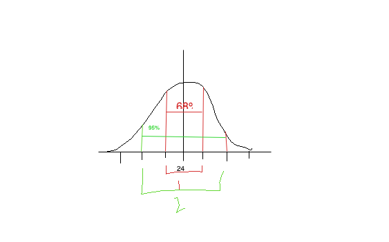

# Statistics

Is a tool that will be used to perform computation on dataset inorder to get meaningful insights.

could be classified into two categories

| descripitive statistics | inferential statistics    |
| :---------------------- | :------------------------ |
| used to understand data | helps in making decisions |


Population: represents entire group, represented with `N`
sample: a subset of a group, represented with `n`, should have min of 30 (cox of central limit theorem)

## Types of data

1. **Numerical data**
   a. Also called quantitative data
   b. can be classsified into
      1. **Discrete** - anything that is countable (e.g. how many people, entered show at this time?)
      2. **Continious** - tho, represented as whole number, but they have infinite values inbetween them, e.g. timeseries or Keyword: **proportion**, **length**

2. **Non-numerical data**
   a. Aslo called qualitative/categorical data more of open ended word
   b. can be classsified into
      1. **Nominal** - some repeated value, cannot be ordered e.g. fav food in a class group
      2. **Ordinal** - where you can order it, ratings (bad < good < better < best)

interval:  cannot compare with other value, absolute zero value does not exists, comparison does not make sense
ratio: comparison is meaning full in ratios, zero exists


## descriptive statistics
```
Types
├── measures of central tendancy
│   ├── Mean/Avg
│   ├── Median
│   └── Mode
│
└── measure of variation/spread
    ├── Range
    ├── Quantile
    ├── IQR
    ├── Variance
    └── Standard Deviation
```

### measures of central tendancy
**Mean**: tells you about averge 
(sum of all values / n) 
(x bar) for avg of sample set
(meu) for avg of population set

$$
\bar{x} = \frac{1}{n}\sum_{i=1}^{n} x_i
$$


**Median**: a single measure cannont represent the whole group, coz outliers might impact the average result, thats where median comes into play.
e.g. a company salary's avg cannot tell whole employee's common salary, as some might earn more like CEO, some might earn very low, causing outliers

How to do median?
1. sort data
2. count number of obervations
3. find middle value
4. then take average of middle values

$$\text{Median} = \left(\frac{n+1}{2}\right)^{\text{th}} \text{ value}$$


**Mode**: most frequently occuring value

### measure of variation/spread
```
Types
├── Range
├── Variance
├── Standard Deviation
├── Quantile
└── IQR
```

$$\text{Median} = \frac{\left(\frac{n}{2}\right)^{\text{th}} + \left(\frac{n}{2} + 1\right)^{\text{th}}}{2}$$


**Range**:
uses min and max

$$
\text{Range} = [\min(x), \max(x)]
$$

**Variance**:

- uses all values, and compares with mean value

- high variance - diverse dataset; low variance - low diversification; zero variance - means dataset with single value, no useful information can be extracted

- sampling variation, depends on the dataset we choose

- confidence interval, help in finding the range of values

- bezels correction: which is used to keep sample set lower than population set, that why the n-1 in the variance formula

- only theoritically used

$$s^2 = \frac{1}{n-1} \sum_{i=1}^{n} (x_i - \bar{x})^2$$

**Standard Deviation**:

- measures how spread out data points are from their average (mean)

- a low SD means data clusters near the mean, indicating consistency, while a high SD shows data spread over a wider range suggesting greater variability or dispersion

- often using the Greek letter sigma (σ) for population or 's' for samples

- can be zero or positive but cannot be negative

- if sd=0, then there is no variance

- practically used

$$\sigma^2 = \frac{\sum (X - \mu)}{n}$$

$$s=\sqrt{\frac{\sum (x_{i}-\={x})^{2}}{n-1}}$$


**Quantile**: 
- finding a point that can split data into four segments
- help you to determine, where you stand in the segments, like distinction/first class/second class
- uses box plot or whisker plot
- Decile - 10 parts = 9 cuts
- Percentail - 100 parts = 99 cuts

i.e. `n parts = n-1 cuts`

Q2: 
- uses median
- used in symentric data, where it splits data into two parts
```
|--------|--------|
|  50%   |  50%   |
|________|________|
         Q1
```

Q4:
- to divide data into 4 equal parts, 3 cuts points (Q) are required

```
|--------|--------|--------|--------|
|  25%   |  25%   |  25%   |  25%   |
|________|________|________|________|
         Q1       Q2       Q3
```


**Steps**:
1. sort the data
2. find number of terms, find `n`
3. find cut points i.e. `Q1, Q2, Q3`
   - Q1 = 25% i.e. formula =`(0.25) * (n+1)`, nothing but median of first half's median
   - Q2 = 50% i.e. formula =`(0.50) * (n+1)`, this is nothing but median
   - Q3 = 75% i.e. formula =`(0.75) * (n+1)`, nothing but median of second half's median
   NOTE: 
   - why (n+1)? - its formula bro, TODO
   - here the 25, 50, 75 can be termed as p

Formula: `(p/100) * (n+1)`

**Inter Quantile Range(IQR)**
- if you want find the outliers for the dataset to understand distribution
- is calculated by the difference bw Q3 and Q1 (Q3 -Q1)
- This is a range of quatile
- using IQR find, lower and upper bound of whisker 
  `Lower bound = Q1 - 1.5 * IQR`
  if you have lower bound of 2 but you have range  [1, 2, 5, 7, 13], then lower-bound=1, coz of min value
  `Upper bound = Q3 + 1.5 * IQR`
  why 1.5: as 99.7% falls under Q3, the remaining are 0.15 on left and 0.15 on right of the distribution chart, thus we use 1.5


**5 Number summary**:
These are 5 member who can summarize the data
- min
- max
- Q1 / Third or upper quantile / First quadrant
- Q2 / Second quadrant
- Q3 / Third or upper quantile / Third quadrant

# Measure of dispersion(spread)

1. Normal/Gaussian Distribution
   
   

   - if its a normal distribution, then 68% should fall b/w 1 sd (emprical study)
   - if 2 sd then 95% of data must sit, based on emprical study
   - if the distribution is not symentric, we called it skewed, on which-ever side its skewed, we call it right or left skewed


---

[problem 1](../notebooks/day1_b.ipynb)