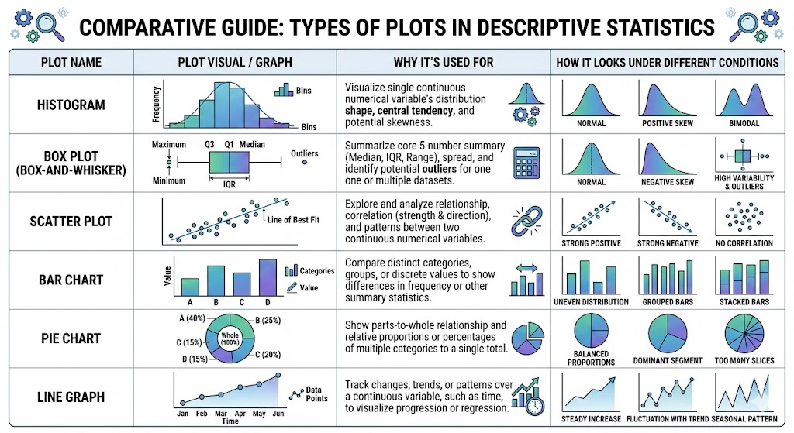

  <a href="./descriptive-stats.md"><b>← Previous</b></a>
  
    <a href="./x.md"><b>Next →</b></a>
  

---

# Visualization used in descriptive statistics

---

  <a href="./descriptive-stats.md"><b>← Previous</b></a>
  
    <a href="./x.md"><b>Next →</b></a>
  

